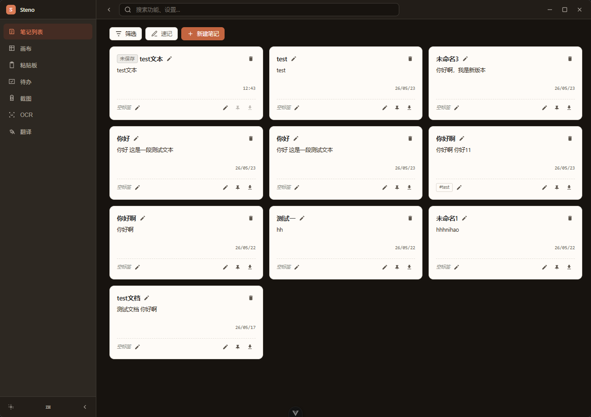
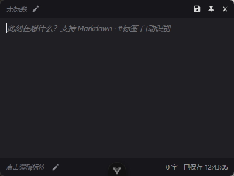
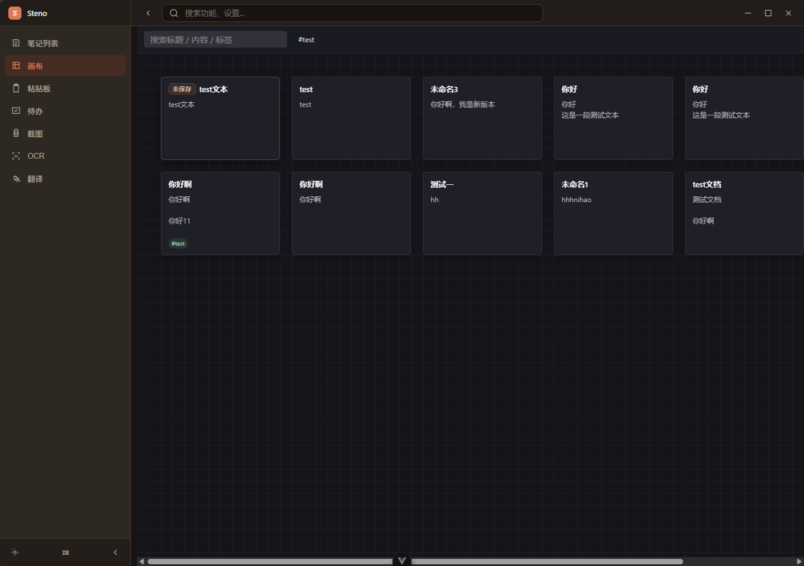
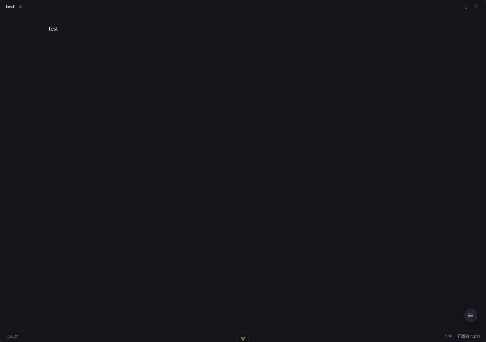
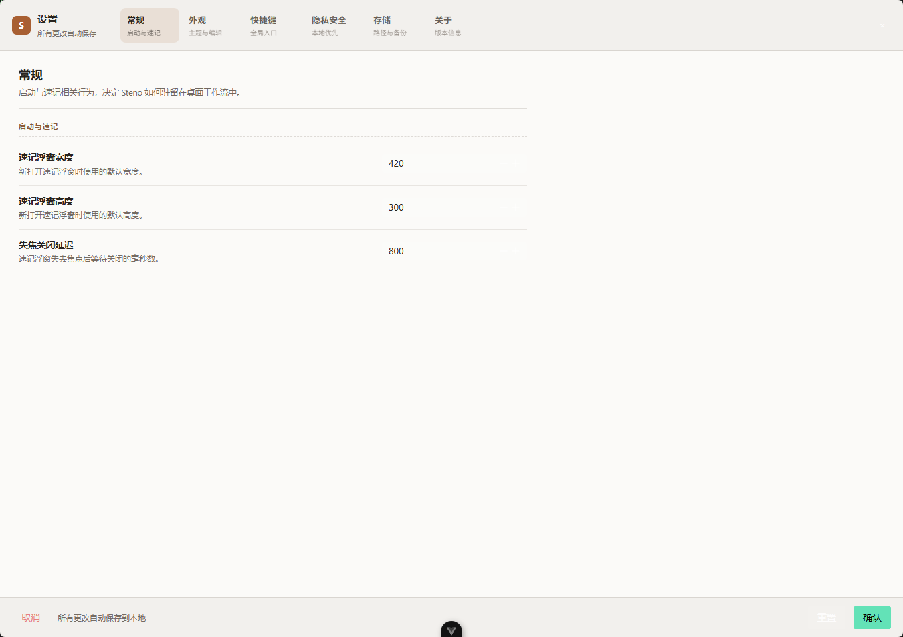

<p align="center">
  
</p>

<h1 align="center">Steno · 速记</h1>

<p align="center">
  <strong>一款本地优先的桌面速记工具</strong><br />
  用 Rust + Tauri 2 + Vue 3 构建 · 捕获优先，稍后整理，输出 Markdown
</p>

<p align="center">
  <a href="#-快速开始">快速开始</a> ·
  <a href="#-应用截图">应用截图</a> ·
  <a href="#-特性">特性</a> ·
  <a href="#-技术栈">技术栈</a> ·
  <a href="#-项目结构">项目结构</a> ·
  <a href="#-赞赏支持">赞赏</a>
</p>

<p align="center">
  <a href="./README.en_US.md">English</a>
</p>

---

## 📖 简介

**Steno** 的核心理念是：**捕获优先，稍后整理**。

你写代码、看视频、开会、聊天时突然想记一笔——按下全局快捷键，速记浮窗即刻出现在任何应用之上。写完自动保存，事后再用无限画布或 Zen 模式整理成长文，一键导出 Markdown。

> 它是你的"第二大脑"的快捷入口，不打断心流，不切换应用。

当前主窗口采用统一工作台布局：自定义标题栏、可折叠侧边导航和内容区共用一个壳层。「新建笔记」进入主窗口编辑页，「新建速记」打开浮窗；待办支持主窗口管理 + 全局快捷键呼出浮窗；粘贴板、截图、OCR、翻译模块仍在规划中。

---

## 🖼 应用截图

### 主窗口 — 笔记列表

> 统一的笔记管理工作台：搜索、标签筛选、右键操作、拖拽排序。

<p align="center">
  
</p>

### 速记浮窗 — 任何应用之上

> `Ctrl+Shift+M` 呼出，输入停手 1 秒自动保存。支持 Markdown 快捷语法 + `#tag` 标签自动识别。

<p align="center">
  
</p>

### 无限画布 — 空间化整理

> 自由拖拽、缩放、平移卡片。搜索与标签过滤，双击进入 Zen 编辑。

<p align="center">
  
</p>

### Zen 写作模式 — 沉浸式长文

> 全屏无干扰写作环境，右侧大纲面板导航。Esc 一键退出。

<p align="center">
  
</p>

### 设置面板

> 主题切换、全局快捷键、浮窗尺寸、失焦延迟、数据目录查看与复制。

<p align="center">
  
</p>

---

## ✨ 特性

| | 特性 | 说明 |
|---|------|------|
| 🌌 | **常驻托盘** | 启动后仅托盘图标待命，不占用桌面空间 |
| ⚡ | **全局快捷键** | `Ctrl+Shift+N` 切换主窗口 · `Ctrl+Shift+M` 呼出浮窗 · `Ctrl+Shift+T` 呼出待办 |
| 📝 | **速记浮窗** | 任何应用之上弹出，Markdown 语法 + `#tag` 标签，自动保存 |
| 📌 | **置顶便签** | 笔记可"钉"在桌面，多窗口并存，可调透明度/颜色/字号 |
| ✅ | **待办浮窗** | 全局快捷键呼出今日待办，跨窗口同步；主窗口提供分类管理（今天 / 计划中 / 进行中 / 已暂停 / 已完成 / 收件箱 / 全部） |
| 🗺 | **无限画布** | 卡片自由排列/缩放/平移，标签过滤，双击编辑 |
| 🧘 | **Zen 模式** | 全屏沉浸写作，大纲导航，Esc 退出 |
| 🌗 | **亮/暗/系统主题** | 跟随系统，OKLCH 均匀色彩空间，瞬切 |
| 🔒 | **本地优先** | 所有数据存本机 SQLite（`~/.steno/data.db`），默认不上传 |
| 📤 | **Markdown 导出** | 单条导出含 YAML frontmatter；HTML 导出含内联样式 |

---

## 🚀 快速开始

### 环境要求

| 依赖 | 最低版本 |
|------|----------|
| Node.js | ≥ 20.19.0 |
| pnpm | ≥ 10.5.0 |
| Rust | ≥ 1.85 |

**Windows**：MSVC C++ Build Tools + Windows 10/11 SDK + WebView2 Runtime  
**macOS**：Xcode Command Line Tools  
**Linux**：参考 [Tauri 系统依赖](https://v2.tauri.app/start/prerequisites/#linux)

### 开发

```bash
# 安装依赖
pnpm install

# 启动开发模式（首次编译 Rust 依赖约 1-3 分钟）
pnpm tauri:dev

# 仅启动前端（Vite dev server，不启动 Tauri 窗口）
pnpm dev
```

### 构建

```bash
# 生产构建 → src-tauri/target/release/bundle/
pnpm tauri:build
```

### 质量检查

```bash
pnpm typecheck   # vue-tsc --noEmit
pnpm lint        # oxlint + eslint --fix
pnpm fmt         # oxfmt
cd src-tauri && cargo test   # Rust 单元测试
```

---

## 🧱 技术栈

| 层 | 技术 |
|---|------|
| 桌面框架 | [Tauri 2](https://tauri.app/) |
| 后端 | Rust 2024 + tokio + rusqlite + pulldown-cmark |
| 前端框架 | Vue 3 (Composition API) + TypeScript + Vite 7 |
| UI 组件 | [Naive UI](https://www.naiveui.com/) + [UnoCSS](https://unocss.dev/) |
| 编辑器 | [CodeMirror 6](https://codemirror.net/) + 自建 live-render 装饰器 |
| 状态管理 | [Pinia](https://pinia.vuejs.org/) |
| 工程化 | pnpm monorepo + oxlint + oxfmt + simple-git-hooks |

---

## 📁 项目结构

```
steno/
├── src/                          # Vue 3 前端
│   ├── main.ts                   # 应用入口
│   ├── App.vue                   # 根组件：按 WindowMode 路由到各视图
│   ├── components/
│   │   ├── FloatingEditor.vue    # 速记浮窗 / 置顶便签
│   │   ├── Canvas.vue            # 无限画布核心
│   │   ├── MarkdownEditor.vue    # CodeMirror 6 + WYSIWYG 编辑器
│   │   ├── MainWorkbenchShell.vue# 主窗口壳层（标题栏 + 侧边栏 + 内容区）
│   │   ├── DocumentOutlineTree.vue # 递归大纲树
│   │   ├── MarkdownReadSurface.vue# 只读 Markdown 渲染面板
│   │   └── markdown-editor/      # CM6 扩展：快捷键、live-render 插件
│   ├── views/
│   │   ├── MainView.vue          # 笔记列表卡片网格
│   │   ├── NoteEditorView.vue    # 主窗口内笔记编辑页
│   │   ├── CanvasView.vue        # 画布视图容器
│   │   ├── ZenMode.vue           # 全屏写作
│   │   ├── SettingsView.vue      # 设置面板
│   │   └── PlaceholderView.vue   # 规划中模块占位页
│   ├── composables/              # Composition API hooks
│   │   ├── useDb.ts              # Tauri invoke 类型化封装
│   │   ├── useWindow.ts          # 窗口控制 + 失焦/拖拽监听
│   │   ├── useAutosave.ts        # 1s 防抖保存调度器
│   │   ├── useMarkdown.ts        # marked 渲染 + CJK 字数 + #tag 提取
│   │   ├── useMarkdownOutline.ts # 标题提取 → 大纲树构建
│   │   ├── useAppEvents.ts       # 跨窗口事件总线
│   │   └── useResizablePane.ts   # 可拖拽面板
│   ├── stores/
│   │   ├── ui.ts                 # 窗口路由（WindowMode）
│   │   ├── notes.ts              # 笔记缓存 + CRUD
│   │   └── settings.ts           # 设置 reactive view-model
│   ├── types/steno.ts            # 与 Rust models 对齐的 IPC DTO
│   └── theme/index.ts            # 亮/暗主题 CSS 变量（OKLCH）
│
├── src-tauri/                    # Rust 后端
│   ├── src/
│   │   ├── lib.rs                # Tauri Builder → plugins + commands + setup
│   │   ├── main.rs               # 薄入口
│   │   ├── db.rs                 # SQLite CRUD + migration + 内容派生
│   │   ├── models.rs             # IPC 序列化 DTO
│   │   ├── commands.rs           # #[tauri::command] 边界
│   │   ├── window_manager.rs     # 多窗口创建/聚焦/路由
│   │   ├── quicknote.rs          # 速记浮窗 toggle
│   │   ├── shortcut.rs           # 全局快捷键注册/重载
│   │   ├── tray.rs               # 系统托盘 + 右键菜单
│   │   ├── export.rs             # Markdown / HTML / PDF 导出
│   │   ├── backup.rs             # SQLite 文件备份
│   │   └── sync.rs               # 同步 trait（预留）
│   ├── Cargo.toml
│   └── tauri.conf.json
│
├── packages/                     # pnpm workspace 共享包
│   ├── axios/                    # Axios 封装（重试、取消、flat request）
│   ├── color/                    # 调色板与颜色工具
│   ├── hooks/                    # 通用 Vue hooks
│   ├── utils/                    # crypto、storage、nanoid、klona
│   ├── scripts/                  # CLI 工具脚本
│   └── uno-preset/               # UnoCSS shortcuts 预设
│
├── docs/                         # 需求文档、原型、截图
├── openspec/                     # OpenSpec 变更跟踪
└── public/                       # 静态资源
```

---

## 📂 数据目录

| 路径 | 说明 |
|------|------|
| `~/.steno/data.db` | SQLite 数据库（`notes` + `settings` 两表） |
| `~/.steno/backup/` | 每累计 10 次修改触发一次的 `.db` 副本 |
| `~/.steno/exports/` | 导出的 Markdown / HTML 文件（`<title>-<short_id>.md`） |

数据目录可在「设置 → 存储区域」查看完整路径并一键复制。

---

## 🔧 常用命令

| 命令 | 说明 |
|------|------|
| `pnpm dev` | Vite dev server（端口 21420） |
| `pnpm tauri:dev` | Tauri 开发窗口 |
| `pnpm tauri:build` | 生产构建 |
| `pnpm typecheck` | `vue-tsc --noEmit` 类型检查 |
| `pnpm lint` | `oxlint + eslint --fix` |
| `pnpm fmt` | `oxfmt` 格式化 |
| `cd src-tauri && cargo test` | Rust 单元测试 |
| `cd src-tauri && cargo check` | Rust 编译检查（不生成产物） |

---

## 🗺 路线图

| 阶段 | 内容 | 状态 |
|------|------|------|
| 0 | Tauri 壳 + 工程化骨架 | ✅ 已完成 |
| 1 | 托盘 + 全局快捷键 + 速记浮窗 + 本地保存 | ✅ 已完成 |
| 2 | 置顶便签 + 无限画布 | ✅ 已完成 |
| 3 | Zen 模式 + 全局搜索 + 亮/暗主题 | ✅ 已完成 |
| 4 | Markdown 导出 + 设置面板 + 跨平台打包 | 🚧 进行中 |

> **MVP 不含**：云同步、多人协作、AI 功能、移动端、插件市场。详见 [`openspec/changes/build-steno-mvp/follow-ups.md`](./openspec/changes/build-steno-mvp/follow-ups.md)。

---

## 💙 赞赏支持

如果 Steno 帮到了你，欢迎请开发者喝杯咖啡 ☕

<p align="center">
  <table align="center">
    <tr>
      <td align="center" width="50%">
        <br />
        <strong>微信赞赏</strong>
      </td>
      <td align="center" width="50%">
        <br />
        <strong>支付宝赞赏</strong>
      </td>
    </tr>
  </table>
</p>

---

## 📄 许可证

[MIT](./LICENSE) © Steno Contributors
